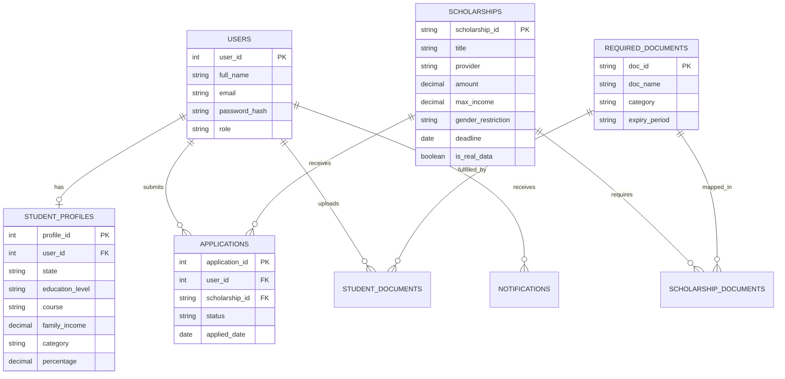
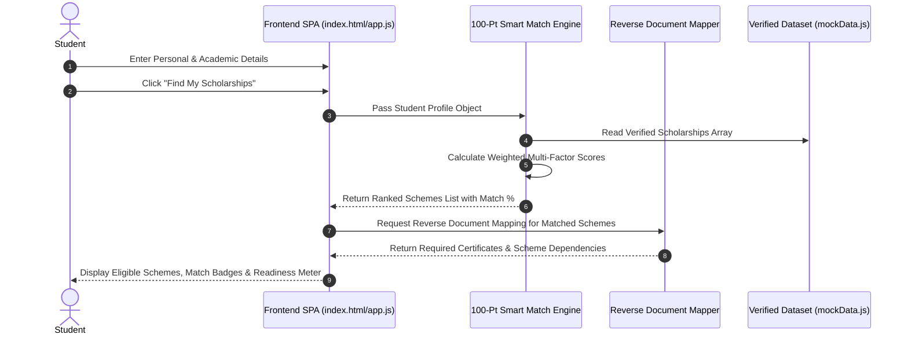
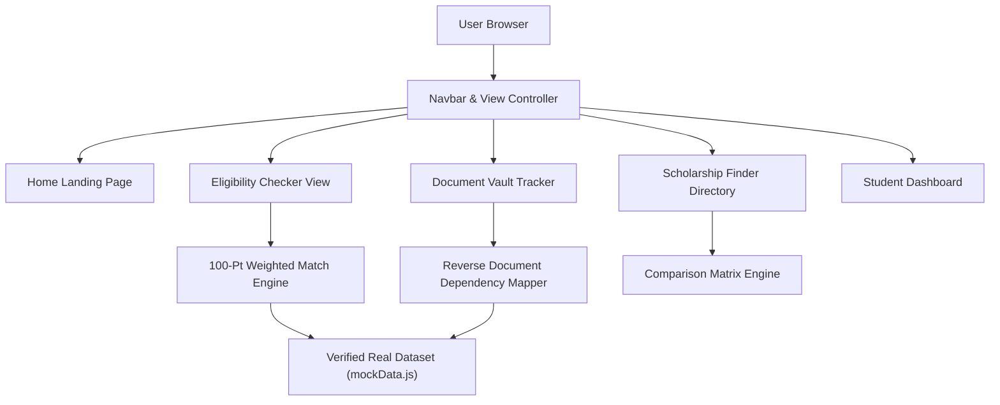

# 📊 UML & Entity-Relationship (ER) Diagrams

## 1. Entity-Relationship (ER) Diagram

---

## 2. System Sequence Diagram (Profile -> Smart Match -> Document Check)

---

## 3. Component Architecture Diagram

